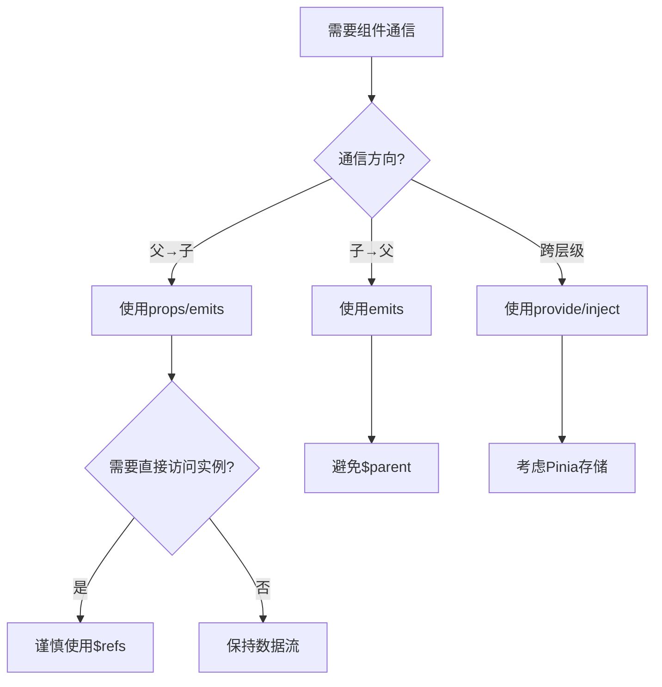
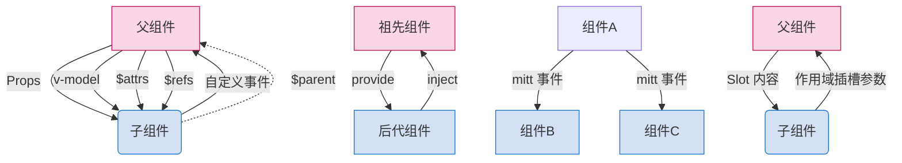
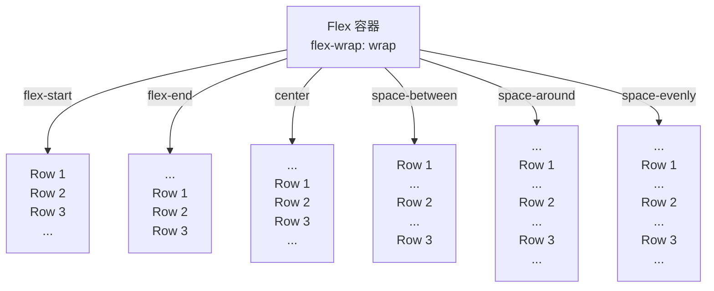

# VUE 3

## 源码升级

- 使用`Proxy`代替`defineProperty`实现响应式。

- 重写虚拟`DOM`的实现和`Tree-Shaking`。

  
##  TypeScript

- `Vue3`可以更好的支持`TypeScript`。

  
## 新特性

1. `Composition API`（组合`API`）：
   - `setup`
   - `ref`与`reactive`
   - `computed`与`watch`
   
     ......
   
2. 新的内置组件：
   - `Fragment`
   - `Teleport`
   - `Suspense`

     ......

3. 其他改变：
   - 新的生命周期钩子
   - `data` 选项应始终被声明为一个函数
   - 移除`keyCode`支持作为` v-on` 的修饰符

     ......


# 创建Vue3工程

## 基于 vue-cli 创建
查看[官方文档](https://cli.vuejs.org/zh/guide/creating-a-project.html#vue-create)

> 备注：目前`vue-cli`已处于维护模式，官方推荐基于 `Vite` 创建项目。

```powershell
## 查看@vue/cli版本，确保@vue/cli版本在4.5.0以上
vue --version

## 安装或者升级你的@vue/cli 
npm install -g @vue/cli

## 执行创建命令
vue create vue_test

##  随后选择3.x
##  Choose a version of Vue.js that you want to start the project with (Use arrow keys)
##  > 3.x
##    2.x

## 启动
cd vue_test
npm run serve
```

---

##  基于 vite 创建(推荐)
`vite` 是新一代前端构建工具，官网地址：[https://vitejs.cn](https://vitejs.cn/)，`vite`的优势如下：

- 轻量快速的热重载（`HMR`），能实现极速的服务启动。
- 对 `TypeScript`、`JSX`、`CSS` 等支持开箱即用。
- 真正的按需编译，不再等待整个应用编译完成。
- `webpack`构建 与 `vite`构建对比图如下：
	
* 具体操作如下（点击查看[官方文档](https://cn.vuejs.org/guide/quick-start.html#creating-a-vue-application)）

```powershell
## 1.创建命令
npm create vue@latest

## 2.具体配置
## 配置项目名称
√ Project name: vue3_test
## 是否添加TypeScript支持
√ Add TypeScript?  Yes
## 是否添加JSX支持
√ Add JSX Support?  No
## 是否添加路由环境
√ Add Vue Router for Single Page Application development?  No
## 是否添加pinia环境
√ Add Pinia for state management?  No
## 是否添加单元测试
√ Add Vitest for Unit Testing?  No
## 是否添加端到端测试方案
√ Add an End-to-End Testing Solution? » No
## 是否添加ESLint语法检查
√ Add ESLint for code quality?  Yes
## 是否添加Prettiert代码格式化
√ Add Prettier for code formatting?  No
```
自己动手编写一个App组件

```vue
<template>
  <div class="app">
    <h1>你好啊！</h1>
  </div>
</template>

<script lang="ts">
  export default {
    name:'App' //组件名
  }
</script>

<style>
  .app {
    background-color: #ddd;
    box-shadow: 0 0 10px;
    border-radius: 10px;
    padding: 20px;
  }
</style>
```

---

总结：

- `Vite` 项目中，`index.html` 是项目的入口文件，在项目最外层。
- 加载`index.html`后，`Vite` 解析 `<script type="module" src="xxx">` 指向的`JavaScript`。
- `Vue3`**中是通过 **`createApp` 函数创建一个应用实例。
## 简单的效果

`Vue3`向下兼容`Vue2`语法，且`Vue3`中的模板中可以没有根标签


---

# Vue3核心语法

## OptionsAPI 与 CompositionAPI

- `Vue2`的`API`设计是`Options`（配置）风格的。
- `Vue3`的`API`设计是`Composition`（组合）风格的。
###  Options API 的弊端

`Options`类型的 `API`，数据、方法、计算属性等，是分散在：`data`、`methods`、`computed`中的，若想新增或者修改一个需求，就需要分别修改：`data`、`methods`、`computed`，不便于维护和复用。


### Composition API 的优势

可以用函数的方式，更加优雅的组织代码，让相关功能的代码更加有序的组织在一起。


---

## setup
### setup 概述
`setup`是`Vue3`中一个新的配置项，值是一个**函数**

>**组件中所用到的：数据、方法、计算属性、监视......等等，均配置在`setup`中。**

特点如下：

- `setup`中一般不会使用到`this`,`this`是`undefined`。 

- `setup`函数返回的对象中的内容，可直接在模板中使用。
- `setup`函数会在`beforeCreate`之前调用，它是“**领先**”所有钩子执行的。
  - 也即 在原有`vue2` 写法中的`data`中，若`setup` 想要使用data中的属性会报 `undefined `的错误
  - <span style ="color:red">这也解释了为什么`setup`无`this` => 组件实例还没有被创建，自然没有`this`</span>
  - 可以使用**箭头**函数 =>
```vue
<template>
  <div class="person">
    <h2>姓名：{{name}}</h2>
    <h2>年龄：{{age}}</h2>
    <button @click="changeName">修改名字</button>
    <button @click="changeAge">年龄+1</button>
    <button @click="showTel">点我查看联系方式</button>
  </div>
</template>
 
<script lang="ts">
  export default {
    name:'Person',
    setup(){
      // 数据，原来写在data中（注意：此时的name、age、tel数据都不是响应式数据）
      let name = '张三'
      let age = 18
      let tel = '13888888888'

      // 方法，原来写在methods中
      function changeName(){
        name = 'zhang-san' //注意：此时这么修改name页面是不变化的
        console.log(name)
      }
      function changeAge(){
        age += 1 //注意：此时这么修改age页面是不变化的
        console.log(age)
      }
      function showTel(){
        alert(tel)
      }

      // 返回一个对象，对象中的内容，模板中可以直接使用
      return {name,age,tel,changeName,changeAge,showTel}
    }
  }
</script>
```
---

### setup 的返回值

- 若返回一个**对象**：则对象中的：属性、方法等，在模板中均可以直接使用**（重点关注）。**
- 若返回一个**函数**：则可以自定义渲染内容，代码如下：
```jsx
setup(){
  return ()=> '你好啊！' // 可以随意使用箭头函数，因为this为undefined
}
```
### setup 与 Options API 的关系

- `Vue2` 的配置（`data`、`methos`......）中**可以访问到** `setup`中的属性、方法。
- 但在`setup`中**不能访问到**`Vue2`的配置（`data`、`methos`......）。
- 如果与`Vue2`冲突，则`setup`优先。


### setup 语法糖

`setup`函数有一个语法糖，这个语法糖，可以把`setup`独立出去

```vue
<template>
  <div class="person">
    <h2>姓名：{{name}}</h2>
    <h2>年龄：{{age}}</h2>
    <button @click="changName">修改名字</button>
    <button @click="changAge">年龄+1</button>
    <button @click="showTel">点我查看联系方式</button>
  </div>
</template>

<script lang="ts">
  export default {
    name:'Person',
  }
</script>

<!-- 下面的写法是setup语法糖 -->
<script setup lang="ts">
  console.log(this) //undefined
  
  // 数据（注意：此时的name、age、tel都不是响应式数据）
  let name = '张三'
  let age = 18
  let tel = '13888888888'

  // 方法
  function changName(){
    name = '李四'//注意：此时这么修改name页面是不变化的
  }
  function changAge(){
    console.log(age)
    age += 1 //注意：此时这么修改age页面是不变化的
  }
  function showTel(){
    alert(tel)
  }
</script>
```
扩展：上述代码，还需要编写一个不写`setup`的`script`标签，去指定组件名字，可以借助`vite`中的插件简化

1. 第一步：`npm i vite-plugin-vue-setup-extend -D`
2. 第二步：`vite.config.ts`
```jsx
import { defineConfig } from 'vite'
import VueSetupExtend from 'vite-plugin-vue-setup-extend'

export default defineConfig({
  plugins: [ VueSetupExtend() ]
})
```

3. 第三步：`<script setup lang="ts" name="Person">`

---


## ref 创建：基本类型的响应式数据

- **作用：**定义响应式变量,用于创建响应式的`API`
- **语法：**`let xxx = ref(初始值)`
- **返回值：**一个`RefImpl`的实例对象，简称`ref对象`或`ref`，`ref`对象的`value`**属性是响应式的**
- **注意点：**
   - `JS`中操作数据需要：`xxx.value`，但插值模板`{{}}`中不需要`.value`，直接使用即可。
   - 对于`let name = ref('张三')`来说，`name`不是响应式的，`name.value`是响应式的。
```vue
<script setup lang="ts" name="Person">
  import {ref} from 'vue'
  // name和age是一个RefImpl的实例对象，简称ref对象，它们的value属性是响应式的。
  let name = ref('张三')
  let age = ref(18)
  let tel = '13888888888'

  function changeName(){
    // JS中操作ref对象时候需要.value
    name.value = '李四'
    console.log(name.value)

    // 注意：name不是响应式的，name.value是响应式的，所以如下代码并不会引起页面的更新。
    // name = ref('zhang-san')
  }
  function changeAge(){
    // JS中操作ref对象时候需要.value
    age.value += 1 
    console.log(age.value)
  }
  function showTel(){
    alert(tel)
  }
</script>
```
### ref 原理

- 将传入的值 **包装**为一个带有`value`属性的对象(**Refmpl实例**)
  - 如果是基本类型(number)，则会**直接**进行包装
  - 若是对象类型，则会调用内部的 `reactive`将其转换为**响应式对象**,后续会介绍reactive
- 通过 `getter`和`setter` 拦截对`.value`的访问及修改
  - 当在模板或计算属性中读取`count.value` ，**vue会自动追踪依赖**

---

## reactive ：对象类型的响应式数据

- **作用：**定义一个**响应式对象**（基本类型不要用，要用`ref`，否则报错）
- **语法：**`let 响应式对象= reactive(源对象)`。
- **返回值：**一个`Proxy`的实例对象，简称：响应式对象。
- **注意点：**`reactive`定义的响应式数据是“深层次”的。
```vue

<script lang="ts" setup name="Person">
import { reactive } from 'vue'

// 数据
let car = reactive({ brand: '奔驰', price: 100 })
let games = reactive([
  { id: 'ahsgdyfa01', name: '英雄联盟' },
  { id: 'ahsgdyfa02', name: '王者荣耀' },
  { id: 'ahsgdyfa03', name: '原神' }
])
let obj = reactive({
  a:{
    b:{
      c:{
        d:666
      }
    }
  }
})

function changeCarPrice() {
  car.price += 10
}
function changeFirstGame() {
  games[0].name = '流星蝴蝶剑'
}
function test(){
  obj.a.b.c.d = 999
}
</script>
```
---

## ref 创建：对象类型的响应式数据

- 其实`ref`接收的数据可以是：**基本类型**、**对象类型**。
- 若`ref`接收的是对象类型，内部其实也是调用了`reactive`函数。
```vue
<template>
  <div class="person">
    <h2>汽车信息：一台{{ car.brand }}汽车，价值{{ car.price }}万</h2>
    <h2>游戏列表：</h2>
    <ul>
      <li v-for="g in games" :key="g.id">{{ g.name }}</li>
    </ul>
    <h2>测试：{{obj.a.b.c.d}}</h2>
    <button @click="changeCarPrice">修改汽车价格</button>
    <button @click="changeFirstGame">修改第一游戏</button>
    <button @click="test">测试</button>
  </div>
</template>

<script lang="ts" setup name="Person">
import { ref } from 'vue'

// 数据
let car = ref({ brand: '奔驰', price: 100 })
let games = ref([
  { id: 'ahsgdyfa01', name: '英雄联盟' },
  { id: 'ahsgdyfa02', name: '王者荣耀' },
  { id: 'ahsgdyfa03', name: '原神' }
])
let obj = ref({
  a:{
    b:{
      c:{
        d:666
      }
    }
  }
})

console.log(car)

function changeCarPrice() {
  car.value.price += 10
}
function changeFirstGame() {
  games.value[0].name = '流星蝴蝶剑'
}
function test(){
  obj.value.a.b.c.d = 999
}
</script>
```
### ref 对比 reactive

|        特性        |               `ref`               |              `reactive`              |
| :----------------: | :-------------------------------: | :----------------------------------: |
|    **数据类型**    |         于基本类型和对象          | **仅适用于对象**（包括数组、Map 等） |
|    **访问方式**    |      必须通过 `.value` 访问       |    直接访问属性（无需 `.value`）     |
|   **响应式原理**   |     包装对象 + getter/setter      |              Proxy 代理              |
|   **深层响应式**   |   对象类型会递归调用 `reactive`   |            默认深层响应式            |
| **模板中自动解包** | 在模板中自动解包（无需 `.value`） |            直接使用属性名            |
|    **适用场景**    |   基本类型、需要明确控制的引用    |        复杂对象、嵌套数据结构        |

宏观角度：

> 1. `ref`用来定义：**基本类型数据**、**对象类型数据**；
>
> 2. `reactive`用来定义：**对象类型数据**。

- 区别：

> 1. `ref`创建的变量必须使用`.value`（可以使用vue-offical`.value`）
>
>    
>
>    - 自动补全 `ref`中的` .value`
>
> 2. `reactive`重新分配一个新对象，会**失去**响应式（可以使用`Object.assign`去整体替换）

```javascript
function changeCar(){
    //car={brand:'xiaomi',price:25} error
    //car=reactive({brand:'xiaomi',price:25}) error
    // 上述两种方法都会 重新分配一个对象，也即失去响应式，若要修改成响应式
    // 采用 object.assign() 
    Object.assign(car,{brand:'xiaomi',price:25})
}
```


- 使用原则：
  - 基本类型的响应式数据，必须使用`ref`。
  - 响应式对象，层级不深，`ref`、`reactive`都可以。
  - 响应式对象，且层级较深，推荐使用`reactive`。

---


## toRefs , toRef

情况：简单的`解构赋值`自然不会影响`vue`的响应式变化

- 原因：解构赋值 是 值拷贝**(浅拷贝)** 而非引用绑定(从对象提取当前值给新的变量，**解构得到的是值的副本**),自然不会影响vue的响应式更新


- 作用：将一个响应式对象中的每一个属性，转换为`ref`对象。
- 备注：`toRefs`与`toRef`功能一致，但`toRefs`可以批量转换。
- 语法如下：

```vue
<script setup lang="ts">
import { reactive, ref, toRefs } from 'vue'

let car = reactive({ brand: '奔驰', price: 100 })

// 问题：采用解构赋值的时候, 是否可以在方法体中直接用属性名进行操作？
// ? 同样的，{{ car.brand }},{{ car.price }} => {{brand}} {{price}} 也不会变

// let {brand,price}=car

// console.log(brand,price); // 正常输入brand和price,值拷贝

// ! 解决办法，使用 toRefs 解构保持响应式
// ! 原理：torefs会将响应式的对象的 每个属性 都转为 ref对象，解构后 需要用 .value 进行访问
let {brand,price}=toRefs(car)
console.log(brand,price);
    
    
   // 另外一种写法 toRef()
let addprice=toRef(car,'price')

function changeBrand(){
    // car.brand+='~'
    // brand+='`' // 失效
     // !原因：解构赋值 是 值拷贝(浅拷贝) 而非引用绑定(从对象提取当前值给新的变量，解构得到的是值的副本),自然不会影响vue的响应式更新

    brand.value+='`'
   
    
}
function changePrice(){
    // car.price+=10
    price.value+=5
}

</script>
```


## computed

作用：根据已有数据计算出新数据（和`Vue2`中的`computed`作用一致）。

- 核心特性
  - **自动依赖追踪**：自动检测计算函数内部依赖的响应式数据
  - **惰性计算(**带缓存)：只有依赖发生变化的时候，才会重新调用计算属性，否则直接返回缓存值
    - 采用` function()` 是没有缓存的
  - **响应式返回**：返回的是 computedRef对象(类似ref)
  - 包含**只可读**和**可写**两种属性
    - 两种属性的差别在于是否传入 `setter`对象方法对技术属性值进行修改


也可以在控制台中查看，`fullName`是计算属性


```vue
<script setup lang="ts">
import { computed, ref } from 'vue';

    let firstName=ref('Taylor')
    let lastName=ref('Swift')

    
    //为了模板的简化性，一般在computed属性中写需求
    // ! 创建一个只读的计算属性 readonly
    let fullName=computed(()=>{
        console.log(fullName);
        console.log(1);
        
        return firstName.value.slice(0,1).toUpperCase()+firstName.value.slice(1)+'-'+lastName.value

        // return 'fullName'
    })

    // ! 创建可写属性 重点：在set中对值进行操作
    let fullName2=computed({
        get:()=>firstName.value+'-'+lastName.value,
        set:(newName)=>{
            console.log(newName);
            // firstName.value=newName.split('-')[0]
            // lastName.value=newName.split('-')[1]

            const [str1,str2]=newName.split('-')
            firstName.value=str1
            lastName.value=str2
        }
    })
    
    
    function changeName(){
        // fullName.value='stark' error  readonly的计算属性
        // console.log(fullName2);
        fullName2.value='robert-stark'
    }


</script>
```
---

## watch

- 作用：监视数据的变化（和`Vue2`中的`watch`作用一致）
- 特点：`Vue3`中的`watch`只能监视以下**四种数据**：
> 1. `ref`定义的数据。
> 2. `reactive`定义的数据。
> 3. 函数返回一个值（`getter`函数）。
> 4. 一个包含上述内容的数组。

我们在`Vue3`中使用`watch`的时候，通常会遇到以下几种情况：
### * 情况一
监视`ref`定义的【基本类型】数据：直接写数据名即可，监视的是其`value`值的改变。

```vue
<template>
  <div class="person">
    <h1>情况一：监视【ref】定义的【基本类型】数据</h1>
    <h2>当前求和为：{{sum}}</h2>
    <button @click="changeSum">点我sum+1</button>
  </div>
</template>

<script lang="ts" setup name="Person">
  import {ref,watch} from 'vue'
  // 数据
  let sum = ref(0)
  // 方法
  function changeSum(){
    sum.value += 1
  }
  // 监视，情况一：监视【ref】定义的【基本类型】数据
  const stopWatch = watch(sum,(newValue,oldValue)=>{
    console.log('sum变化了',newValue,oldValue)
    if(newValue >= 10){
      stopWatch()
    }
  })
</script>
```
### * 情况二
监视`ref`定义的【对象类型】数据：直接写数据名，监视的是对象的【地址值】，若想监视对象内部的数据，要手动开启深度监视。

> 注意：
>
> * 若修改的是`ref`定义的对象中的属性，`newValue` 和 `oldValue` 都是新值，因为它们是同一个对象。
>
> * 若修改整个`ref`定义的对象，`newValue` 是新值， `oldValue` 是旧值，因为不是同一个对象了。

```vue
<template>
  <div class="person">
    <h1>情况二：监视【ref】定义的【对象类型】数据</h1>
    <h2>姓名：{{ person.name }}</h2>
    <h2>年龄：{{ person.age }}</h2>
    <button @click="changeName">修改名字</button>
    <button @click="changeAge">修改年龄</button>
    <button @click="changePerson">修改整个人</button>
  </div>
</template>

<script lang="ts" setup name="Person">
  import {ref,watch} from 'vue'
  // 数据
  let person = ref({
    name:'张三',
    age:18
  })
  // 方法
  function changeName(){
    person.value.name += '~'
  }
  function changeAge(){
    person.value.age += 1
  }
  function changePerson(){
    person.value = {name:'李四',age:90}
  }
  /* 
    监视，情况一：监视【ref】定义的【对象类型】数据，监视的是对象的地址值，若想监视对象内部属性的变化，需要手动开启深度监视
    watch的第一个参数是：被监视的数据
    watch的第二个参数是：监视的回调
    watch的第三个参数是：配置对象（deep、immediate等等.....） 
  */
  watch(person,(newValue,oldValue)=>{
    console.log('person变化了',newValue,oldValue)
  },{deep:true})
  
</script>
```
### *  情况三
监视`reactive`定义的【对象类型】数据，且默认开启了深度监视。
```vue
<template>
  <div class="person">
    <h1>情况三：监视【reactive】定义的【对象类型】数据</h1>
    <h2>姓名：{{ person.name }}</h2>
    <h2>年龄：{{ person.age }}</h2>
    <button @click="changeName">修改名字</button>
    <button @click="changeAge">修改年龄</button>
    <button @click="changePerson">修改整个人</button>
    <hr>
    <h2>测试：{{obj.a.b.c}}</h2>
    <button @click="test">修改obj.a.b.c</button>
  </div>
</template>

<script lang="ts" setup name="Person">
  import {reactive,watch} from 'vue'
  // 数据
  let person = reactive({
    name:'张三',
    age:18
  })
  let obj = reactive({
    a:{
      b:{
        c:666
      }
    }
  })
  // 方法
  function changeName(){
    person.name += '~'
  }
  function changeAge(){
    person.age += 1
  }
  function changePerson(){
    Object.assign(person,{name:'李四',age:80})
  }
  function test(){
    obj.a.b.c = 888
  }

  // 监视，情况三：监视【reactive】定义的【对象类型】数据，且默认是开启深度监视的
  watch(person,(newValue,oldValue)=>{
    console.log('person变化了',newValue,oldValue)
  })
  watch(obj,(newValue,oldValue)=>{
    console.log('Obj变化了',newValue,oldValue)
  })
</script>
```
### * 情况四
监视`ref`或`reactive`定义的【对象类型】数据中的**某个属性**，注意点如下：

1. 若该属性值**不是**【对象类型】，需要写成函数形式。
2. 若该属性值是**依然**是【对象类型】，可直接编，也可写成函数，建议写成函数。

结论：监视的要是对象里的属性，那么最好写函数式，注意点：若是对象监视的是地址值，需要关注对象内部，需要手动开启深度监视。

```vue
<template>
  <div class="person">
    <h1>情况四：监视【ref】或【reactive】定义的【对象类型】数据中的某个属性</h1>
    <h2>姓名：{{ person.name }}</h2>
    <h2>年龄：{{ person.age }}</h2>
    <h2>汽车：{{ person.car.c1 }}、{{ person.car.c2 }}</h2>
    <button @click="changeName">修改名字</button>
    <button @click="changeAge">修改年龄</button>
    <button @click="changeC1">修改第一台车</button>
    <button @click="changeC2">修改第二台车</button>
    <button @click="changeCar">修改整个车</button>
  </div>
</template>

<script lang="ts" setup name="Person">
  import {reactive,watch} from 'vue'

  // 数据
  let person = reactive({
    name:'张三',
    age:18,
    car:{
      c1:'奔驰',
      c2:'宝马'
    }
  })
  // 方法
  function changeName(){
    person.name += '~'
  }
  function changeAge(){
    person.age += 1
  }
  function changeC1(){
    person.car.c1 = '奥迪'
  }
  function changeC2(){
    person.car.c2 = '大众'
  }
  function changeCar(){
    person.car = {c1:'雅迪',c2:'爱玛'}
  }

  // 监视，情况四：监视响应式对象中的某个属性，且该属性是基本类型的，要写成函数式
  /* watch(()=> person.name,(newValue,oldValue)=>{
    console.log('person.name变化了',newValue,oldValue)
  }) */

  // 监视，情况四：监视响应式对象中的某个属性，且该属性是对象类型的，可以直接写，也能写函数，更推荐写函数
  watch(()=>person.car,(newValue,oldValue)=>{
    console.log('person.car变化了',newValue,oldValue)
  },{deep:true})
</script>
```
### * 情况五
监视上述的多个数据
```vue
<script lang="ts" setup name="Person">
  import {reactive,watch} from 'vue'

  // 数据
  let person = reactive({
    name:'张三',
    age:18,
    car:{
      c1:'奔驰',
      c2:'宝马'
    }
  })
  // 方法
  function changeName(){
    person.name += '~'
  }
  function changeAge(){
    person.age += 1
  }
  function changeC1(){
    person.car.c1 = '奥迪'
  }
  function changeC2(){
    person.car.c2 = '大众'
  }
  function changeCar(){
    person.car = {c1:'雅迪',c2:'爱玛'}
  }

  // 监视，情况五：监视上述的多个数据
  watch([()=>person.name,person.car],(newValue,oldValue)=>{
    console.log('person.car变化了',newValue,oldValue)
  },{deep:true})

</script>
```
## watchEffect

* 立即运行一个函数，同时**追踪所有的响应式依赖**，并在依赖更改时重新执行该函数。

* `watch`对比`watchEffect`

汇总如下:

|     特性     |                       `watch`                       |                `watchEffect`                 |
| :----------: | :-------------------------------------------------: | :------------------------------------------: |
| **监听方式** | 显式指定要监听的数据源（`ref`/`reactive`/`getter`） |    自动追踪回调函数内的**所有响应式依赖**    |
| **初始执行** |       默认不执行（需配置 `immediate: true`）        |               **立即执行一次**               |
| **回调参数** |             提供 `(newValue, oldValue)`             |   **无参数**（直接访问响应式数据的最新值）   |
| **适用场景** |         需要精确控制监听的数据源和变化逻辑          | 依赖自动追踪的简单副作用（如日志、异步请求） |
| **深度监听** |             需手动配置 `{ deep: true }`             |         **自动深度追踪**（无法关闭）         |

* 示例代码：

  ```vue
  <script setup lang="ts">
      import { watch, ref, watchEffect } from 'vue';
  
      let temp=ref(10)
      let height=ref(0)
  
      function changeTemp(){
          temp.value+=10
      }
      function changeHeight(){
          height.value+=10
      }
  
      // ?需求，当水温达到60°C或者水位到80m，给服务器发请求，利用watch属性
      // !若监视的属性过多，普通的watch按照数组形式写太冗余
      /* watch([temp,height],(val)=>{
          console.log('watch');// 不会立即执行
          
          let[newTemp,newHeight]=val
          if(newTemp>=80 || newHeight>=50){
              console.log('to server');
          }
      }) */
  
      // !利用 watchEffect 实现
      //! 自动追踪回调函数内的 所有响应式依赖,并且会立即执行一次
      // ?无参数，直接访问响应式数据的最新值
      // ?自带深度追踪
      watchEffect(()=>{
          console.log('watchEffect'); // 立即执行输出
          if(temp.value>=80 || height.value>=50){
              console.log('to server');
          }
      })
  
  
  </script>
  ```

  ---

## 标签的 ref 属性

作用：用于注册模板引用。

> * 用在普通`DOM`标签上，获取的是`DOM`节点
>
> * 用在组件标签上，获取的是组件实例对象

注：**可以用在组件通信中，父组件通过给子组件添加`ref`属性，用于访问子组件中的`方法or属性`**

用在普通`DOM`标签上：

```vue
<template>
  <div class="person">
    <h1 ref="title1">尚硅谷</h1>
    <h2 ref="title2">前端</h2>
    <h3 ref="title3">Vue</h3>
    <input type="text" ref="inpt"> <br><br>
    <button @click="showLog">点我打印内容</button>
  </div>
</template>

<script lang="ts" setup name="Person">
  import {ref} from 'vue'
	
  let title1 = ref()
  let title2 = ref()
  let title3 = ref()

  function showLog(){
    // 通过id获取元素
    const t1 = document.getElementById('title1')
    // 打印内容
    console.log((t1 as HTMLElement).innerText)
    console.log((<HTMLElement>t1).innerText)
    console.log(t1?.innerText)
    
		/************************************/
		
    // 通过ref获取元素
    console.log(title1.value)
    console.log(title2.value)
    console.log(title3.value)
  }
</script>
```

用在组件标签上：

```vue
<!-- 父组件App.vue -->
<template>
    <div>
        <h1 class="app">
            <!-- <PersonVue3/> -->
             <!-- <h2 id="title2">222</h2> -->
            <Car ref="AppCar"/>
            <button @click="showAppCar">点我输出car</button>
        </h1>
    </div>
</template>

<script lang="ts" setup name="App">
     import { ref } from 'vue';
    let AppCar=ref()
    function showAppCar(){
        console.log(AppCar.value); // ! 输出Car子组件实例
        // ?处于对子组件的保护，默认是不会输出子组件的一些组件内的信息(内部状态的私有化)
        // ?采用defineExpose来 暴露某些信息

        //调用子组件 increment方法
        console.log(AppCar.value.increment());
}
</script>

<!-- 子组件Person.vue中要使用defineExpose暴露内容 -->
<script setup lang="ts">
    import { ref,defineExpose } from 'vue';
    let title2=ref()
    // 要暴露的变量 or 方法
    let a=ref(10)
    let b=ref(20)
    let increment=()=>b.value++

    // ? 传统的使用id来给标签打上标识，重名标识会存在输出错误的问题

    function showTitle2(){
        // console.log(document.querySelector('#title2'));
        console.log(title2.value);
}
    
    defineExpose({a,b,increment}) //! 暴露组件的属性或方法给父组件


</script>
```

---

## props

props(properties) 是vue组件之间传递数据的一种机制 ，**允许 父组件 向 子组件 传递数据**

props作用

- **组件通信**：父组件可以通过  props 向子组件传递数据
- **组件复用**：不同的 props 值可以使组件呈现不同的状态
- **单向数据流**：反过来不行
- **类型验证**：可以对传入的数据进行类型检查

> ```js
> // 定义person 接口，限制对象的具体格式
> export interface PersonInter{
>     id:number,
>     name:string,
>     age:number,
>     gender:string
> }
> 
> // 自定义类型 PersonsList 用于定义多个人
> export type PersonsList=Array<PersonInter>
> // 或者写成 export type PersonsList=PersonInter[]
> ```
>
> `App.vue`中代码：
>
> ```vue
> <script lang="ts" setup name="App">
> import { reactive } from 'vue';
> import Car from './components/Car.vue';
> import { PersonsList } from '@/types';
> 
> let x=9
> 
> let personList=reactive<PersonsList>([
>         {id:3,name:'zs',age:18,gender:'female'},
>         {id:4,name:'ls',age:15,gender:'male'},
>         {id:5,name:'ww',age:13,gender:'female'}
>     ])
> 
> 
> </script>
> 
> ```
>
> `Person.vue`中代码：
>
> ```Vue
> <script setup lang="ts">
>     import {type PersonsList } from '@/types';
>     import { defineProps } from 'vue';
> 
>     //! props(properties) 是vue组件之间传递数据的一种机制 ，允许 父组件 向 子组件 传递数据
>     
>     // ! 第一种方法：仅接受，此时的a是只读属性read only，不能对其进行修改的操作
>     // !必须写成数组的格式
>     // const props=defineProps(['a','list'])
>     // console.log(props.list);
> 
>     // ! 第二种情况，当父组件传递过来的props存在问题，子组件可以通过 在defineProps设置泛型来进行约束
>     // 限制子组件 接受类型 list 是personList类型
>     // defineProps<{list:PersonsList}>()
> 
> 
>     // !第三种情况：限制必要性 + 指定默认值
>     //? 限制必要性 ts的可选属性即可 list?:PersonsList
>     // 采用withDefaults()，默认接受两个参数
>         // ?props：通过 defineProps 定义的 Props 对象。
>         // ? defaults：一个对象，指定各 Prop 的默认值。
>     let props2=withDefaults(defineProps<{list:PersonsList,a:string}>(),
>     // 这里传入默认值
>     {
>         //! 注意传入默认值类型对应上 
>         list:()=>[{id:3,name:'zs',age:18,gender:'female'}],
>         a:'555'
>     })
>     
> 
> 
>     function addA(){
>         // props.a+=1 //error ,a readonly
>     }
> 
> </script>
> ```
>

---

## 生命周期

* 概念：`Vue`组件实例在创建时要经历一系列的初始化步骤，在此过程中`Vue`会在合适的时机，调用特定的函数，从而让开发者有机会在特定阶段运行自己的代码，这些特定的函数统称为：生命周期钩子

* 规律：

  > 生命周期整体分为四个阶段，分别是：**创建、挂载、更新、销毁**，每个阶段都有两个钩子，一前一后。

* `Vue2`的生命周期

  > 创建阶段：`beforeCreate`、`created`
  >
  > 挂载阶段：`beforeMount`、`mounted`
  >
  > 更新阶段：`beforeUpdate`、`updated`
  >
  > 销毁阶段：`beforeDestroy`、`destroyed`

  具体可以参考如下图：

  

* `Vue3`的生命周期

  > 创建阶段：`setup`
  >
  > 挂载阶段：`onBeforeMount`、`onMounted`
  >
  > 更新阶段：`onBeforeUpdate`、`onUpdated`
  >
  > 卸载阶段：`onBeforeUnmount`、`onUnmounted`

* 常用的钩子：`onMounted`(挂载完毕)、`onUpdated`(更新完毕)、`onBeforeUnmount`(卸载之前)

* 示例代码：

  ```vue
  <template>
    <div class="person">
      <h2>当前求和为：{{ sum }}</h2>
      <button @click="changeSum">点我sum+1</button>
    </div>
  </template>
  
  <!-- vue3写法 -->
  <script lang="ts" setup name="Person">
    import { 
      ref, 
      onBeforeMount, 
      onMounted, 
      onBeforeUpdate, 
      onUpdated, 
      onBeforeUnmount, 
      onUnmounted 
    } from 'vue'
  
    // 数据
    let sum = ref(0)
    // 方法
    function changeSum() {
      sum.value += 1
    }
    console.log('setup')
    // 生命周期钩子
    onBeforeMount(()=>{
      console.log('挂载之前')
    })
    onMounted(()=>{
      console.log('挂载完毕')
    })
    onBeforeUpdate(()=>{
      console.log('更新之前')
    })
    onUpdated(()=>{
      console.log('更新完毕')
    })
    onBeforeUnmount(()=>{
      console.log('卸载之前')
    })
    onUnmounted(()=>{
      console.log('卸载完毕')
    })
  </script>
  ```

## 自定义hook

- 什么是`hook`？—— 本质是一个函数，把`setup`函数中使用的`Composition API`进行了封装，类似于`vue2.x`中的`mixin`。

作用：

- 自定义 `Hooks `允许将可复用的逻辑封装成独立函数

- `Hooks` 可以将组件拆分成更小的，可复用的单元，**提升代码的可维护性，复用性**

- `Hooks`命名一般 use+应用场景 例如计算器 `useCount.ts`

- 引入`Hooks` 符合vue3中的`composition` 组合式api(一个模块只关注自己要完成的功能)

注意点：

- `hook`中，**`.ts`默认是需要返回一个对象**

示例代码：

- `useDogs.ts`中内容如下：

  ```js
  // 自定义hooks
  import { ref,reactive } from 'vue';
  import axios from 'axios'
  
  // 可以选择默认暴露 或者 暴露具体函数名
  
  export default function(){ // 或者暴露具体函数名字export  function useDogs()
  
      // https://dog.ceo/api/breed/pembroke/images/random
      let dogList=reactive([
          'https:\/\/images.dog.ceo\/breeds\/pembroke\/n02113023_3913.jpg'
      ])
  
  
      async function addDog(){
          try {
              let result=await axios.get('https://dog.ceo/api/breed/pembroke/images/random')
              console.log(result.data);
              dogList.push(result.data.message)
          } catch (error) {
              console.log(error);
              
          }
      }
  
      // ! 默认返回一个对象
      //! 作用：返回对象允许​​按需解构​​，避免依赖顺序
      return {
          dogList,
          addDog
      }
  }
  
  ```
  
- `useSum.ts`中内容如下：

  ```js
  import { ref,reactive,onMounted } from 'vue';
  import axios from 'axios'
  
  
  export default function(){
  
      let sum=ref(0)
  
      function changeSum(){
          sum.value+=1
      }
  
      onMounted(()=>{
      changeSum()
      })
  
      //! 注意return
      return{
          sum,changeSum
      }
  
  }
  ```
  
- 组件中具体使用：

  ```vue
  <template>
      <div class="person">
          {{ sum }}
          <button @click="changeSum">点我sum++</button>
          <br>
          
          <br>
          <button @click="addDog">再来一只狗</button><br>
      </div>
  
  </template>
  
  <script setup lang="ts">
      import useSum from '@/hooks/useSum';
      import useDogs from '@/hooks/useDogs';
  
      // 解构赋值 
      const {sum,changeSum}=useSum()
      const {dogList,addDog}=useDogs()
  
      /* // 解决命名冲突 通过对象属性进行命名，
      const {dogList:dogs}=useDogs() // 重命名dogList
      console.log(dogs); */
      
  
  </script>
  ```
  
    

---

# 路由

## 对路由的理解

**将`URL`路径映射到组件树的结构化系统**

**核心三要素**：

- **路由表**：定义路径与组件的映射关系
- **路由器实例**：管理路由状态和导航
- **路由视图**：`<router-view>` 组件作为渲染出口

## 路由配置

- `Vue3`中要使用`vue-router`的最新版本，目前是`4`版本

- 路由配置文件代码如下：

  - `router/index.ts`
  
  ```js
  // 创建路由
  import About from "@/components/About.vue";
  import Car from "@/components/Car.vue";
  import Home from "@/components/Home.vue";
  
  import { createRouter,createWebHashHistory } from "vue-router";
  
  const router = createRouter({
      //设置路由器的工作模式
      history:createWebHashHistory(),
      //具体路由
      routes:[
          {
              path:'/home',
              component:Home
          },
          {
              path:'/cars',
              component:Car
          },
          {
              path:'/about',
              component:About
          }
  ]
  })
  // 暴露router
  export default router
  ```
* `main.ts`

  ```js
  //引入 createApp 用于创建应用
  import {createApp} from 'vue'
  
  // 引入APP根组件
  import App from './App.vue'
  // 引入路由
  import router from './router'
  
  //创建 app应用
  const app=createApp(App)
  // 使用路由
  app.use(router)
  
  // 挂载到app容器
  app.mount('#app')
  
  ```

- `App.vue`代码

  ```vue
  <template>
      <div class="app">
          <h2 class="title">路由测试</h2>
          <!-- 导航区 -->
          <div class="navigate">
              <RouterLink to="/home"  active-class="active">首页</RouterLink>
              <RouterLink to="/cars"  active-class="active">汽车</RouterLink>
              <RouterLink to="/about" active-class="active">关于</RouterLink>
          </div>
          <!-- 具体展示区 -->
          <div class="main-content">
              <RouterView></RouterView>
          </div>
      </div>
  </template>
  
  <script lang="ts" setup name="App">
  import { RouterView,RouterLink } from 'vue-router';
  
  
  </script>
  ```


## 注意点

> 1. 路由组件通常存放在`pages` 或 `views`文件夹，一般组件通常存放在`components`文件夹。
>
>    - 路由组件：通过编写路由规则映射的`<RouterLink>`
>
>    - 一般组件：自编写的，例如`<Header/>`
>
>      ```vue
>      <!-- 一般组件区 -->
>              	<Header/>
>                            
>      <!-- 导航区(路由组件) -->
>              <div class="navigate">
>                  <RouterLink to="/home"  active-class="active">首页</RouterLink>
>                  <RouterLink to="/cars"  active-class="active">汽车</RouterLink>
>                  <RouterLink to="/about" active-class="active">关于</RouterLink>
>              </div>
>                            
>      <!-- 具体展示区 -->
>              <div class="main-content">
>                  <RouterView></RouterView>
>              </div>
>      ```
>
>      ---
>
> 2. 通过点击导航，视觉效果上“消失” 了的路由组件，默认是被**卸载**掉的，需要的时候再去**挂载**。


## 路由器工作模式

`路由模式`的选择

- vue2 :mode:"history"

- vue3,这里以`hash`模式为例，具体配置如下

```vue
import { createRouter, createWebHashHistory } from 'vue-router'

const router = createRouter({
  history: createWebHashHistory(), // 使用 URL hash
  routes: [...]
})
```

- `三种路由模式`的对比

|    **特性**    |    Hash 模式     |               History 模式                |    Memory 模式    |
| :------------: | :--------------: | :---------------------------------------: | :---------------: |
| **URL 美观度** |  不美观（带#）   |                   美观                    |     无URL变化     |
| **服务器要求** |   无需特殊配置   |                 需要配置                  |      无要求       |
|  **SEO 支持**  |        差        |                    好                     |        无         |
|   **兼容性**   |    所有浏览器    |               HTML5+ 浏览器               |     所有环境      |
|  **刷新行为**  |     不会404      | 需配置避免404<br />(需要配合后端路径问题) |      无刷新       |
|  **典型应用**  | 无后端支持的项目 |               企业级Web应用               | SSR/测试/Electron |

---


## to的两种写法

```vue
<!-- 第一种：to的字符串写法 -->
<router-link active-class="active" to="/home">主页</router-link>

<!-- 第二种：to的对象写法 -->
<router-link active-class="active" :to="{path:'/home'}">Home</router-link>
```


## 命名路由

作用：可以简化路由跳转及传参

给路由规则命名：

```js
routes:[
  {
    name:'zhuye',
    path:'/home',
    component:Home
  },
  {
    name:'xinwen',
    path:'/news',
    component:News,
  },
  {
    name:'guanyu',
    path:'/about',
    component:About
  }
]
```

跳转路由：

```vue
<!--简化前：需要写完整的路径（to的字符串写法） -->
<router-link to="/news/detail">跳转</router-link>

<!--简化后：直接通过名字跳转（to的对象写法配合name属性） -->
<router-link :to="{name:'guanyu'}">跳转</router-link>
```


## 嵌套路由

1. 编写`News`的子路由：`Detail.vue`

2. 配置路由规则，使用`children`配置项：

   ```ts
   const router = createRouter({
     history:createWebHistory(),
   	routes:[
   		{
   			name:'zhuye',
   			path:'/home',
   			component:Home
   		},
   		{
   			name:'xinwen',
   			path:'/news',
   			component:News,
   			children:[
   				{
   					name:'xiang',
   					path:'detail',
   					component:Detail
   				}
   			]
   		},
   		{
   			name:'guanyu',
   			path:'/about',
   			component:About
   		}
   	]
   })
   export default router
   ```
   
3. 跳转路由（记得要加完整路径）：

   ```vue
   <router-link to="/news/detail">xxxx</router-link>
   <!-- 或 -->
   <router-link :to="{path:'/news/detail'}">xxxx</router-link>
   ```

4. 记得去`Home`组件中预留一个`<router-view>`

   ```vue
   <template>
     <div class="news">
       <nav class="news-list">
         <RouterLink v-for="news in newsList" :key="news.id" :to="{path:'/news/detail'}">
           {{news.name}}
         </RouterLink>
       </nav>
       <div class="news-detail">
         <RouterView/>
       </div>
     </div>
   </template>
   ```

   

## 路由传参

### query参数

   1. 传递参数

      ```vue
       <ul >
                  <li v-for="item in carsList" :key="item.id">
                      <!-- 其中一种写法，利用模板字符串 -->
                      <!-- <RouterLink :to="`/cars/cardetail?id=${item.id}&brand=${item.brand}&model=${item.model}`" >{{ item.brand }}</RouterLink> -->
      
                      <!-- 标准写法：:to写对象 -->
                      <RouterLink 
                      :to="{// name:'vehicledetail',可以使用name
                          path:'/cars/detail',
                          query:{id:item.id,brand:item.brand,model:item.model}
                          }">
                      {{ item.brand }}
                  </RouterLink>
                  </li>
              </ul>
          </div>
          <!-- 展示区 -->
              <div class="vehicle-content">
                  <RouterView></RouterView>
              </div>
      ```

   2. 接收参数：

      ```js
      import {useRoute} from 'vue-router'
      const route = useRoute()
      // 打印query参数
      console.log(route.query)
      // ! 解构赋值 注意toRefs保持引用解构，确保响应式更新
      const {query}=toRefs(route)
      console.log(query);
      ```

---

### params参数

   1. 传递参数

      - 注意点：使用params参数时，**只能用 `name`属性 进行路由跳转**

      ```vue
      <RouterLink 
          :to="{
              //! 使用params参数时，只能用name属性 进行路由跳转
              name:'vehicledetail',
              params:{
                  id:item.id,
                  brand:item.brand,
                  model:item.model
              }
          }" 
          >
          {{ item.brand }}
      </RouterLink>
      ```

   2. 接收参数：

      ```js
      import {useRoute} from 'vue-router'
      const route = useRoute()
      // 打印params参数
      console.log(route.params)
      ```

3.在 router.ts中配置 params 

```ts
{
    name:'vehicle',
    path:'/cars',
    component:Car,
    children:[
        {
            name:'vehicledetail',
            //! 注意子组件不需要 /
            // ! 采用params传递参数 需要再路径中进行 占位
            path:'detail/:id/:brand/:model', 
            component:CarDetail
        }
    ]
 },
```

---


## 路由的props配置

作用：让路由组件更方便的收到参数（可以将路由参数作为`props`传给组件）

```js
{
	name:'xiang',
	path:'detail/:id/:title/:content',
	component:Detail,

  // props的对象写法，作用：把对象中的每一组key-value作为props传给Detail组件
  // props:{a:1,b:2,c:3}, 

  // props的布尔值写法，作用：把收到了每一组params参数，作为props传给Detail组件
  // props:true
  
  // props的函数写法，作用：把返回的对象中每一组key-value作为props传给Detail组件
  props(route){
    return route.query
  }
}
```

##  replace属性

  1. 作用：控制路由跳转时操作浏览器历史记录的模式。

  2. 浏览器的历史记录有两种写入方式：分别为```push```和```replace```：

     - ```push```是追加历史记录（默认值）。
     - `replace`是替换当前记录。

  3. 开启`replace`模式：

     ```vue
     <RouterLink replace .......>News</RouterLink>
     ```

## 编程式导航

路由组件的两个重要的属性：`$route`和`$router`变成了两个`hooks`

```js
import {useRoute,useRouter} from 'vue-router'

const route = useRoute()
const router = useRouter()

console.log(route.query)
console.log(route.parmas)
console.log(router.push)
console.log(router.replace)
```

## 重定向

1. 作用：将特定的路径，重新定向到已有路由。

2. 具体编码：

   ```js
   {
       path:'/',
       redirect:'/about'
   }
   ```


# pinia 


## 搭建 pinia 环境

第一步：`npm install pinia`

第二步：操作`src/main.ts`

```ts
import { createApp } from 'vue'
import App from './App.vue'

/* 引入createPinia，用于创建pinia */
import { createPinia } from 'pinia'

/* 创建pinia */
const pinia = createPinia()
const app = createApp(App)

/* 使用插件 */{}
app.use(pinia)
app.mount('#app')
```

此时开发者工具中已经有了`pinia`选项


## 存储+读取数据

1. `Store`是一个保存：**状态**、**业务逻辑** 的实体，每个组件都可以**读取**、**写入**它。

2. 它有三个概念：`state`、`getter`、`action`，相当于组件中的： `data`、 `computed` 和 `methods`。

3. 具体编码：`src/store/count.ts`

   ```ts
   // 引入defineStore用于创建store
   import {defineStore} from 'pinia'
   
   // 定义并暴露一个store
   export const useCountStore = defineStore('count',{
     // 动作
     actions:{},
     // 状态
     state(){
       return {
         sum:6
       }
     },
     // 计算
     getters:{}
   })
   ```

4. 具体编码：`src/store/talk.ts`

   ```js
   // 引入defineStore用于创建store
   import {defineStore} from 'pinia'
   
   // 定义并暴露一个store
   export const useTalkStore = defineStore('talk',{
     // 动作
     actions:{},
     // 状态
     state(){
       return {
         talkList:[
           {id:'yuysada01',content:'你今天有点怪，哪里怪？怪好看的！'},
        		{id:'yuysada02',content:'草莓、蓝莓、蔓越莓，你想我了没？'},
           {id:'yuysada03',content:'心里给你留了一块地，我的死心塌地'}
         ]
       }
     },
     // 计算
     getters:{}
   })
   ```
   
5. 组件中使用`state`中的数据

   ```vue
   <template>
     <h2>当前求和为：{{ sumStore.sum }}</h2>
   </template>
   
   <script setup lang="ts" name="Count">
     // 引入对应的useXxxxxStore	
     import {useSumStore} from '@/store/sum'
     
     // 调用useXxxxxStore得到对应的store
     const sumStore = useSumStore()
   </script>
   ```

   ```vue
   <template>
   	<ul>
       <li v-for="talk in talkStore.talkList" :key="talk.id">
         {{ talk.content }}
       </li>
     </ul>
   </template>
   
   <script setup lang="ts" name="Count">
     import axios from 'axios'
     import {useTalkStore} from '@/store/talk'
   
     const talkStore = useTalkStore()
   </script>
   ```

   

## 修改数据】(三种方式)

1. 第一种修改方式，直接修改

   ```ts
   countStore.sum = 666
   ```

2. 第二种修改方式：批量修改

   ```ts
   countStore.$patch({
     sum:999,
     school:'atguigu'
   })
   ```

3. 第三种修改方式：借助`action`修改（`action`中可以编写一些业务逻辑）

   ```js
   import { defineStore } from 'pinia'
   
   export const useCountStore = defineStore('count', {
     /*************/
     actions: {
       //加
       increment(value:number) {
         if (this.sum < 10) {
           //操作countStore中的sum
           this.sum += value
         }
       },
       //减
       decrement(value:number){
         if(this.sum > 1){
           this.sum -= value
         }
       }
     },
     /*************/
   })
   ```

4. 组件中调用`action`即可

   ```js
   // 使用countStore
   const countStore = useCountStore()
   
   // 调用对应action
   countStore.incrementOdd(n.value)
   ```


## storeToRefs

- 借助`storeToRefs`将`store`中的数据转为`ref`对象，方便在模板中使用。
- 注意：`pinia`提供的`storeToRefs`只会将数据做转换，而`Vue`的`toRefs`会转换`store`中数据。

```vue
<template>
	<div class="count">
		<h2>当前求和为：{{sum}}</h2>
	</div>
</template>

<script setup lang="ts" name="Count">
  import { useCountStore } from '@/store/count'
  /* 引入storeToRefs */
  import { storeToRefs } from 'pinia'

	/* 得到countStore */
  const countStore = useCountStore()
  /* 使用storeToRefs转换countStore，随后解构 */
  const {sum} = storeToRefs(countStore)
</script>

```

## getters

  1. 概念：当`state`中的数据，需要经过处理后再使用时，可以使用`getters`配置。

  2. 追加```getters```配置。

     ```js
     // 引入defineStore用于创建store
     import {defineStore} from 'pinia'
     
     // 定义并暴露一个store
     export const useCountStore = defineStore('count',{
       // 动作
       actions:{
         /************/
       },
       // 状态
       state(){
         return {
           sum:1,
           school:'atguigu'
         }
       },
       // 计算
       getters:{
         bigSum:(state):number => state.sum *10,
         upperSchool():string{
           return this. school.toUpperCase()
         }
       }
     })
     ```

  3. 组件中读取数据：

     ```js
     const {increment,decrement} = countStore
     let {sum,school,bigSum,upperSchool} = storeToRefs(countStore)
     ```

     

## $subscribe

通过 store 的 `$subscribe()` 方法侦听 `state` 及其变化

```ts
talkStore.$subscribe((mutate,state)=>{
  console.log('LoveTalk',mutate,state)
  localStorage.setItem('talk',JSON.stringify(talkList.value))
})
```


## store组合式写法

```ts
import {defineStore} from 'pinia'
import axios from 'axios'
import {nanoid} from 'nanoid'
import {reactive} from 'vue'

export const useTalkStore = defineStore('talk',()=>{
  // talkList就是state
  const talkList = reactive(
    JSON.parse(localStorage.getItem('talkList') as string) || []
  )

  // getATalk函数相当于action
  async function getATalk(){
    // 发请求，下面这行的写法是：连续解构赋值+重命名
    let {data:{content:title}} = await axios.get('https://api.uomg.com/api/rand.qinghua?format=json')
    // 把请求回来的字符串，包装成一个对象
    let obj = {id:nanoid(),title}
    // 放到数组中
    talkList.unshift(obj)
  }
  return {talkList,getATalk}
})
```


#  组件通信

**`Vue3`组件通信和`Vue2`的区别：**

* 移出事件总线，使用`mitt`代替。

- `vuex`换成了`pinia`。
- 把`.sync`优化到了`v-model`里面了。
- 把`$listeners`所有的东西，合并到`$attrs`中了。
- `$children`被砍掉了。

**常见搭配形式：**

## props

概述：`props`是使用频率最高的一种通信方式，常用与 ：**父 ↔ 子**。

- 若 **父传子**：属性值是**非函数**。
- 若 **子传父**：属性值是**函数**。

`父组件`：

```vue
<template>
  <div class="father">
    <h3>父组件</h3>
	<h4>汽车:{{ car }}</h4>
	<h4 v-if="toy">子传递给父：{{ toy }}</h4>
	<Child :car="car" :sendToy="getToy" />
  </div>
</template>

<script setup lang="ts" name="Father">
	import { ref } from 'vue';
	import Child from './Child.vue'
	
	let car=ref('BMW')
	let toy=ref()

	function getToy(value:string){
		toy.value=value
	}
</script>
```

---

`子组件`

```vue
<template>
  <div class="child">
    <h3>子组件</h3>
	<h4>玩具：{{ toy }}</h4>
	<h4>汽车：{{ car }}</h4>
	<button @click="sendToy(toy)">玩具给父亲</button> 
	<!-- sendToy(toy) 通过传递toy 参数实现 子传父 -->
  </div>
</template>

<script setup lang="ts" name="Child">
	import { ref } from 'vue';

	let toy=ref('迪迦')

	//! props 若要实现 子传父 则要求父组件传递函数，子组件通过调用函数(带参)，传递子组件上的属性
	defineProps(['car','sendToy']) 
	
	
</script>
```

---

## 自定义事件

1. 概述：自定义事件常用于：**子 => 父。**
2. 注意区分好：原生事件、自定义事件。
   - 原生DOM事件通过浏览器原生触发`(input,click)`，自定义事件通过`emit`显式触发

- 原生事件：
  - 事件名是特定的（`click`、`mosueenter`等等）	
  - 事件对象`$event`: 是包含事件相关信息的对象（`pageX`、`pageY`、`target`、`keyCode`）
- 自定义事件：
  - 事件名：任意名称
  - <strong style="color:red">事件对象`$event`: 是调用`emit`时所提供的数据，可以是任意类型！！！</strong >

3. 示例：

   ```html
   <!--在父组件中，给子组件绑定自定义事件：-->
   <Child @send-toy="toy = $event"/>
   
   <!--注意区分原生事件与自定义事件中的$event-->
   <button @click="toy = $event">测试</button>
   ```

   ```js
   //子组件中，触发事件：
   const emit=defineEmits(['myEvent'])
   // ! 子=>父 传递数据,利用emit
   emit('myEvent',toy.value)
   ```

4.具体例子

`父组件`

```vue
<template>
  <div class="father">
    <h3>父组件</h3>
		{{ str }}

		<!-- 通过 $event 获取 button 事件对象 -->
		<button @click="test(3,4,$event)">test</button>
		<h4 >子组件给父组件的toy:{{ toy }}</h4>

	<!-- 给子节点绑定 自定义事件(类似于 @click=) -->
	<!-- 子组件的自定义事件命名采用 kebab-case  -->
    <Child @my-event="handleCustomEvent" />


  </div>
</template>

<script setup lang="ts" name="Father">
	import { ref } from 'vue';
	import Child from './Child.vue';

	
	let toy=ref('')
	
	let str=ref('你好')
	function test(a:number,b:number,c:Event){
		console.log(a,b,c); //c事件对象
	}
    
	// ! 父组件对子组件传递的 数据 进行handle
	function handleCustomEvent(value:string){
		console.log('收到子组件事件',value);
		toy.value=value
	}
</script>

```

`子组件`

```vue
<template>
  <div class="child">
    <h3>子组件</h3>
	<h4>玩具:{{ toy }}</h4>
	
	<!-- 简写形式 -->
	<!-- <button @click="emit('myEvent')">测试</button> -->
  </div>
</template>

<script setup lang="ts" name="Child">
	import { ref } from 'vue';

	let toy=ref('迪迦')

	//!自定义事件，用emit接受 
	// ?子组件中的事件命名采用 camelCase 进行命名

	const emit=defineEmits(['myEvent'])

	// ! 子=>父 传递数据,利用emit
	emit('myEvent',toy.value)

</script>
```


## mitt

概述：与消息订阅与发布（`pubsub`）功能类似，可以实现任意组件间通信。

安装`mitt`

```shell
npm i mitt
```

- mitt包含三个属性
  - **发布（emit）**：触发带有数据的事件
  - **订阅（on）**：监听特定事件
  - **取消订阅（off）**：移除事件监听
  - **一次性订阅（once）**：只监听一次事件


1.新建文件：`src\utils\emitter.ts`

```javascript
// !mitt 是一个极简的 事件发射(emitter)，订阅库(pubsub)

// 导入 mitt
import mitt from "mitt";

//调用 mitt()
const emitter=mitt()

//绑定事件 事件名：testEmitter，回调 ()=>{}
emitter.on('testEmitter',()=>{
  console.log('testEmitter');
})

/* setInterval(() => {
  //触发事件
  emitter.emit('testEmitter')
  
}, 3000); */

//解绑事件
// emitter.off('testEmitter')
// emitter.all.clear()  解绑所有事件

//将 mitt 导出
export default emitter
```


2.提供数据的组件,发射事件(也即将`数据携带出去`)

```typescript
function sendToy(){
		//发布事件，事件名对应上，将toy传递
		emitter.emit('get-toy',toy)
	}
```


3.接收数据的组件中：绑定**监听事件**、同时在销毁前解绑事件：

```typescript
import emitter from "@/utils/emitter";
import { onUnmounted } from "vue";

// 绑定事件
emitter.on('get-toy',(value:string)=>{
		toy.value=value
	})

//!在组件卸载之后，要解绑事件
	onUnmounted(()=>{
		emitter.off('get-toy')
	})
```

**注意这个重要的内置关系，总线依赖着这个内置关系**

---

应用场景：

- **跨组件通信使用**(同组件树优先使用`props/emits`)
- **组件卸载解绑取消事件监听**，防止内存泄漏

---

## v-model

1. 概述：实现 **父↔子** 之间相互通信。

   

2. 在`HTML`标签上 —— `v-model`的本质

   ```vue
    		<!-- v-model用在html标签上 -->
           <input type="text" v-model="username">
   <!-- 上述代码等价于  数据=>页面 :value="username   
   页面=>数据：@input="username=$event.target.value"  -->
         <input 
                type="text" 
                :value="username"        @input="username(<HTMLInputElement>$event.target).value"
                >
   ```

   

3. 组件标签上的`v-model`的本质：`:moldeValue` ＋ `update:modelValue`事件。

   ```vue
   <!-- v-model用在组件标签 -->
            <DiyInput v-model="username"/> 
           <!-- 上述代码本质 props:modelValue 自定义事件:update:modelValue -->
         <DiyInput 
                   :modelValue="username"  				 	 @update:modelValue="newVal=>username=newVal" 
                   />
   
           <!-- 自定义事件等价于 @update:modelValue="username=$event"-->
           <!-- 原生DOM事件中，$event 就是该事件对象，可以通过$event.target.value取值 -->
           <!-- 自定义事件，$event就是子组件传递参数，也即具体的value,直接取值-->
     
   ```

   

   `AtguiguInput`组件中：

   ```vue
   <template>
   
     <input 
       type="text" 
       :value="modelValue" 
       @input="handleChange"
   
     >
   
   <!-- 自定义事件还可以简写成 @input="emit('update:modelValue',(<HTMLInputElement>$event.target.value))" -->
   </template>
   
   <script setup lang="ts" name="DiyInput">
   
     //1.接收props 父=>子
     defineProps(['modelValue'])
   
     //2.接收自定义事件 子=>父
     const emit=defineEmits(['update:modelValue'])
   
     //子组件input变化，通知父组件变化
     function handleChange(e){
       emit('update:modelValue',(<HTMLInputElement>e.target).value)
     }
   
   </script>
   ```

   

4. 也可以更换`value`，例如改成`abc`

   ```vue
   <!-- 也可以更换value，例如改成abc-->
   <AtguiguInput v-model:abc="userName"/>
   
   <!-- 上面代码的本质如下 -->
   <AtguiguInput :abc="userName" @update:abc="userName = $event"/>
   ```

   `AtguiguInput`组件中：

   ```vue
   <template>
     <div class="box">
       <input 
          type="text" 
          :value="abc" 
          @input="emit('update:abc',$event.target.value)"
       >
     </div>
   </template>
   
   <script setup lang="ts" name="AtguiguInput">
     // 接收props
     defineProps(['abc'])
     // 声明事件
     const emit = defineEmits(['update:abc'])
   </script>
   ```

   

5. 如果`value`可以更换，那么就可以在组件标签上多次使用`v-model`

   ```vue
   <AtguiguInput v-model:abc="userName" v-model:xyz="password"/>
   ```

   ---


## $attrs 

1. 概述：`$attrs`用于实现**当前组件的父组件**，向**当前组件的子组件**通信（**祖→孙**）。

2. 具体说明：`$attrs`是一个对象，包含所有父组件传入的标签属性。

   >  注意：`$attrs`会**自动排除`props`中声明的属性**(可以认为声明过的 `props` 被子组件自己“消费”了)

父组件：

```vue
<template>
  <div class="father">
    <h3>父组件</h3>
		<h4>a:{{ a }}</h4>
		<h4>b:{{ b }}</h4>
		<h4>c:{{ c }}</h4>
		<h4>d:{{ d }}</h4>
		<Child :a="a" :b="b" :c="c" :d="d"  v-bind="{x:100,y:200}" :updateA="updataA"/>           <!-- 等价于 :x=100 :y=200 -->
  </div>
</template>

<script setup lang="ts" name="Father">
	import { ref } from 'vue';
	import Child from './Child.vue'
	let a=ref(0)
	let b=ref(1)
	let c=ref(2)
	let d=ref(3)
	
	function updataA(value:number){
		a.value+=value
	}
</script>
```

子组件：

```vue
<template>
	<div class="child">
		<h3>子组件</h3>
		<h4>父组件传递的a={{ a }}</h4>
		<h4>attrs:{{ $attrs }}</h4>

		<!-- 子组件给孙组件传递所有的 $attrs -->
		<GrandChild v-bind="$attrs" />
	</div>
</template>

<script setup lang="ts" name="Child">
	import GrandChild from './GrandChild.vue'

	//子组件只接收了 父组件props中的 a 属性，b c d未接收,
	//! bcd 存在于attrs中
	defineProps(['a'])
</script>
```

孙组件：

```vue
<template>
	<div class="grand-child">
		<h3>孙子组件</h3>
		<h4>爷组件b:{{ b }}</h4>
		<h4>爷组件c:{{ c }}</h4>
		<h4>爷组件d:{{ d }}</h4>
		<h4>爷组件x:{{ x }}(通过useAttrs() )</h4>
		<h4>爷组件y:{{ y}}(通过useAttrs() )</h4>
		
		<button @click="updateA(1)">点我爷组件A+1</button>
	</div>
</template>

<script setup lang="ts" name="GrandChild">

	//!导入 useAttrs
	import { ref, useAttrs } from 'vue';

	let x=ref()
	let y=ref()

	// 通过defineProps读取attrs中的属性
	defineProps(['b','c','d','updateA'])

	//!也可以通过useAttrs()读取,前提是没有在 props 中读取
	const attrs=useAttrs()
	x.value=attrs.x
	y.value=attrs.y
	
</script>
```


## `$refs，$parent`

1. 概述：

   * `$refs`用于 ：**父→子。**
   * `$parent`用于：**子→父。**

2. 原理如下：

   | 属性      | 说明                                                     |
   | --------- | -------------------------------------------------------- |
   | `$refs`   | 值为对象，包含所有被`ref`属性标识的`DOM`元素或组件实例。 |
   | `$parent` | 值为对象，当前组件的父组件实例对象。                     |

> 注：要使用父 or 子组件属性，需要`defineExpose()`进行暴露(详见标签ref属性)

`父组件`

```vue
<template>
	<div class="father">
		<h3>父组件</h3>
		<h4>房产:{{ house }}</h4>
		<button @click="changeToy">点我修改C1的玩具,C2电脑</button> <br>

		<!-- 通过$ref 属性拿到所有子组件实例对象 -->
		<button @click="getAllChild($refs)">获取所有子组件的实例对象,book+2</button>
		<Child1 ref="c1"/>
		<Child2 ref="c2"/>

	</div>
</template>

<script setup lang="ts" name="Father">
	import { ref } from 'vue';
	import Child1 from './Child1.vue'
	import Child2 from './Child2.vue'
	let c1=ref()
	let c2=ref()

	let house=ref(4)
	
	function changeToy(){
		console.log(c1.value);//?出于子组件保护，默认是不能访问，子组件defineExpose进行暴露即可访问
		c1.value.toy='泰罗'
		c2.value.laptop='ASUS'
	}

	function getAllChild(refs:{[key:string]:any}){ //限制类型
		// console.log(refs.c1);
		for (const key in refs) {
			console.log(refs[key]);  //c1,c2实例对象
			refs[key].book+=2
		}
	}

	//暴露ref属性
	defineExpose({house})

</script>
```


`子组件`

```vue
<template>
  <div class="child1">
    <h3>子组件1</h3>
	<h4>toy:{{ toy }}</h4>
	<h4>book:{{ book }}</h4>
	
	<!-- 利用 $parent 获取父组件 -->
	<button @click="getParent($parent)">获取父组件实例对象,house-1</button>
  </div>
</template>

<script setup lang="ts" name="Child1">
	import { ref } from 'vue';

	let toy=ref('奥特曼')
	let book=ref(3)

	//将ref属性进行暴露，父组件可以访问
	defineExpose({toy,book})

	//? 利用$parent访问父组件属性
	function getParent(parent:any){
		console.log(parent);
		parent.house--
	}
</script>
```




---

## provide、inject

1. 概述：实现**祖孙组件**直接通信

   - 在 Vue 3 中，`provide` 和` inject` 是一种用于组件间通信的 API，通常用于**跨多层级组件传递数据**，而无需通过繁琐的 props 逐层传递。<u>它们特别适合在组件树中共享全局状态或服务。</u>

2. 具体使用：

   * 在祖先组件中通过`provide`配置向后代组件提供数据
   * 在后代组件中通过`inject`配置来声明接收数据

3. 具体：

   【第一步】父组件中，使用`provide`提供数据

   ```vue
   <template>
     <div class="father">
       <h3>父组件</h3>
         <h4>money:{{ money }}</h4>
         <h4>vehicle brand:{{ vehicle.brand }}</h4>
         <h4>vehicle price:{{ vehicle.price }}</h4>
       <Child/>
     </div>
   </template>
   
   <script setup lang="ts" name="Father">
     import { provide, reactive, readonly, ref } from 'vue';
     import Child from './Child.vue'
   
     let money=ref(100)
     let vehicle=reactive({
       brand:'lexus',
       price:1000
     })
   
     function updateMoney(value:number){
       money.value+=value
     }
   
     // !provide 和 inject 是实现跨层级组件通信 API，
     // ! 通过依赖注入的方式解决了 prop 逐级传递的繁琐问题 (也即子组件不会参与到通信中，只有爷 孙组件)
   
     //? 在爷组件声明被注入的值 第一个参数：key，第二个参数是提供的值
     // ! 传递的是ref数据，为了确保响应式，传递的应该是整个ref对象，而不是money.value
     provide('money',money)
   
     //reactive对象
     provide('vehicle',vehicle)
     // provide('vehicle',readonly(vehicle)) //只读
   
     //传递方法
     provide('moneyContext',{money,updateMoney})
   
   </script>
   ```

   > 注意：子组件中不用编写任何东西，是不受到任何打扰的

   

   【第二步】孙组件中使用`inject`配置项接受数据。

   ```vue
   <template>
     <div class="grand-child">
       <h3>我是孙组件</h3>
       <h4>爷组件通过provide：money={{ money }} ,brand={{ car.brand }},price{{ car.price }}</h4>
       <button @click="changeCarPrice">点我修改爷组件汽车价格</button>
       <h4>{{ money2 }}</h4>
       <button @click="updateMoney(3)">点我修改爷组件money+3</button>
     </div>
   </template>
   
   <script setup lang="ts" name="GrandChild">
     import { inject, ref } from "vue";
   
     //!在孙组件 接收注入的值,后面跟默认值
     const car=inject('vehicle',{brand:'未知',price:0})
   
     let money:number=inject('money')
     // console.log(money); ref
     
     let {money2,updateMoney}=inject('moneyContext',{money2:0,updateMoney:(x:number)=>{}})
   
     function changeCarPrice(){
       car.price=500 //若 拒绝子组件修改，可在爷组件 provide 中对数据readonly
       money+=1
     }
   
   </script>
   ```


## slot

### 1. 默认插槽


```vue
父组件中：
        <Category title="今日热门游戏">
          <ul>
            <li v-for="g in games" :key="g.id">{{ g.name }}</li>
          </ul>
        </Category>

子组件中：
        <template>
          <div class="item">
            <h3>{{ title }}</h3>
            <!-- 默认插槽 -->
            <slot></slot>
          </div>
        </template>
```

### 2. 具名插槽

```vue
父组件中：
        <Category title="今日热门游戏">
         <!-- v-slot:插槽名  来指定具体的插槽 (只能用在组件 or template标签上)-->
          <template v-slot:s1>
            <ul>
              <li v-for="g in games" :key="g.id">{{ g.name }}</li>
            </ul>
          </template>
         <!-- 简写方式 -->
          <template #s2>
            <a href="">更多</a>
          </template>
        </Category>
子组件中：
        <template>
          <div class="item">
            <h3>{{ title }}</h3>
            <slot name="s1"></slot>
            <slot name="s2"></slot>
          </div>
        </template>
```

### 3. 作用域插槽 

1. 理解：<span style="color:red">数据在组件的自身，但根据数据生成的结构需要组件的使用者来决定。</span>（新闻数据在`News`组件中，但使用数据所遍历出来的结构由`App`组件决定）

   - 也即：**作用域插槽允许子组件提供数据，父组件决定如何渲染**

2. 具体编码：

   - `父组件`

   ```vue
   
    <Game>
        	      <!-- <Game v-slot:default="params"> -->
            	  <!-- <Game #default="params"> -->
           <!-- v-slot="params" 接收子组件slot传递 的所有 props -->
           <template v-slot="params"  >
             子组件：{{ params.x }}，{{ params.y }}
             <ul>
               <li v-for="y in params.youxi" :key="y.id">
                 {{ y.name }}
               </li>
             </ul>
           </template>
     </Game>
   
   ```

- `子组件`

  - ```vue
    <template>
      <div class="game">
        <h2>游戏列表</h2>
        <!--  向父组件传递 所有的props 数据 -->
        <slot :youxi="games" x="哈哈" y="你好" ></slot>
      </div>
    </template>
    
    <script setup lang="ts" name="Game">
      import {reactive} from 'vue'
      // !作用域插槽允许 子组件将数据传递给 父组件的插槽内容，
      // ? 父组件可以在插槽中访问这些数据并自定义渲染逻辑
    
      let games = reactive([
        {id:'asgytdfats01',name:'英雄联盟'},
        {id:'asgytdfats02',name:'王者农药'},
        {id:'asgytdfats03',name:'红色警戒'},
        {id:'asgytdfats04',name:'斗罗大陆'}
      ])
    </script>
    ```

---

## 组件通信汇总


`mermaid`图



### 组件通信方式对比表格

| 通信方式           | 方向            | 适用场景                                 | 特点                           | 优缺点                                  |
| ------------------ | --------------- | ---------------------------------------- | ------------------------------ | --------------------------------------- |
| **Props**          | 父 → 子         | 父组件向子组件传递数据                   | 单向数据流，简单直观           | 无法直接修改，需通过事件通知父组件      |
| **自定义事件**     | 子 → 父         | 子组件向父组件发送事件或数据             | 解耦，灵活                     | 需要显式定义和监听事件                  |
| **mitt**           | 任意组件间      | 全局事件总线，适用于兄弟组件或跨层级通信 | 全局可访问，适合解耦的组件通信 | 可能导致事件管理混乱，难以追踪          |
| **v-model**        | 父 ↔ 子         | 实现父子组件间的双向数据绑定             | 简化双向绑定，语法糖           | 仅适用于特定场景，内部依赖 props 和事件 |
| **$attrs**         | 父 → 子（透传） | 透传未被子组件接收的 props               | 便于多层级 props 传递          | 仅适用于未被子组件显式接收的 props      |
| **$refs**          | 父 → 子         | 父组件获取子组件实例或 DOM 元素          | 直接访问子组件方法或 DOM       | 侵入性强，不推荐频繁使用                |
| **$parent**        | 子 → 父         | 子组件访问父组件实例                     | 直接访问父组件方法或数据       | 侵入性强，破坏封装                      |
| **provide/inject** | 祖先 → 后代     | 跨多层级组件传递数据                     | 适合深层嵌套组件通信           | 隐式传递，难以追踪来源                  |
| **slot**           | 父 → 子         | 父组件向子组件传递内容（HTML、组件等）   | 灵活的内容分发，适合结构化内容 | 主要用于内容传递，而非数据通信          |




# 其它 API

## shallowRef 与 shallowReactive 

### `shallowRef`

1. 作用：创建一个响应式数据，但只对顶层属性进行响应式处理。

2. 用法：

   ```js
   let myVar = shallowRef(initialValue);
   ```

3. 特点：只跟踪引用值的变化，不关心值内部的属性变化。

### `shallowReactive`

1. 作用：创建一个浅层响应式对象，只会使对象的最顶层属性变成响应式的，对象内部的嵌套属性则不会变成响应式的

2. 用法：

   ```js
   const myObj = shallowReactive({ ... });
   ```

3. 特点：对象的顶层属性是响应式的，但嵌套对象的属性不是。

### 总结

> 通过使用 [`shallowRef()`](https://cn.vuejs.org/api/reactivity-advanced.html#shallowref) 和 [`shallowReactive()`](https://cn.vuejs.org/api/reactivity-advanced.html#shallowreactive) 来绕开深度响应。浅层式 `API` 创建的状态只在其顶层是响应式的，对所有深层的对象不会做任何处理，避免了对每一个内部属性做响应式所带来的性能成本，这使得属性的访问变得更快，可提升性能。


## readonly 与 shallowReadonly

### **`readonly`**

1. 作用：用于创建一个对象的深只读副本。

2. 用法：

   ```js
   const original = reactive({ ... });
   const readOnlyCopy = readonly(original);
   ```

3. 特点：

   * 对象的所有嵌套属性都将变为只读。
   * 任何尝试修改这个对象的操作都会被阻止（在开发模式下，还会在控制台中发出警告）。

4. 应用场景：
   * 创建不可变的状态快照。
   * 保护全局状态或配置不被修改。

### **`shallowReadonly`**

1. 作用：与 `readonly` 类似，但只作用于对象的顶层属性。

2. 用法：

   ```js
   const original = reactive({ ... });
   const shallowReadOnlyCopy = shallowReadonly(original);
   ```

3. 特点：

   * 只将对象的顶层属性设置为只读，对象内部的嵌套属性仍然是可变的。

   * 适用于只需保护对象顶层属性的场景。

   
   
   `readonly` vs `shallowReadonly`
   
   | 特性         | readonly                   | shallowReadonly                |
   | ------------ | -------------------------- | ------------------------------ |
   | **只读深度** | 深层（所有嵌套属性只读）   | 浅层（仅顶层属性只读）         |
   | **嵌套对象** | 不可修改                   | ⭐可修改                        |
   | **响应式**   | 是（基于原始对象的响应式） | 是（基于原始对象的响应式）     |
   | **性能**     | 较高开销（深层代理）       | 较低开销（仅顶层代理）         |
   | **典型用法** | 保护整个对象树不被修改     | 保护顶层属性，允许嵌套属性修改 |

---


## toRaw 与 markRaw

### `toRaw`

1. 作用：用于获取一个响应式对象的原始对象， `toRaw` 返回的对象不再是响应式的，不会触发视图更新。

   > 官网描述：这是一个可以用于临时读取而不引起代理访问/跟踪开销，或是写入而不触发更改的特殊方法。不建议保存对原始对象的持久引用，请谨慎使用。

   > 何时使用？ —— 在需要将响应式对象传递给非 `Vue` 的库或外部系统时，使用 `toRaw` 可以确保它们收到的是普通对象

2. 具体编码：

   ```js
   import { reactive,toRaw,markRaw,isReactive } from "vue";
   
   /* toRaw */
   // 响应式对象
   let person = reactive({name:'tony',age:18})
   // 原始对象
   let rawPerson = toRaw(person)
   
   
   /* markRaw */
   let citysd = markRaw([
     {id:'asdda01',name:'北京'},
     {id:'asdda02',name:'上海'},
     {id:'asdda03',name:'天津'},
     {id:'asdda04',name:'重庆'}
   ])
   // 根据原始对象citys去创建响应式对象citys2 —— 创建失败，因为citys被markRaw标记了
   let citys2 = reactive(citys)
   console.log(isReactive(person))
   console.log(isReactive(rawPerson))
   console.log(isReactive(citys))
   console.log(isReactive(citys2))
   ```

### `markRaw`

1. 作用：标记一个对象，使其**永远不会**变成响应式的。

   > 例如使用`mockjs`时，为了防止误把`mockjs`变为响应式对象，可以使用 `markRaw` 去标记`mockjs`

2. 编码：

   ```js
   /* markRaw */
   let citys = markRaw([
     {id:'asdda01',name:'北京'},
     {id:'asdda02',name:'上海'},
     {id:'asdda03',name:'天津'},
     {id:'asdda04',name:'重庆'}
   ])
   // 根据原始对象citys去创建响应式对象citys2 —— 创建失败，因为citys被markRaw标记了
   let citys2 = reactive(citys)
   ```


`toRaw` vs `markRaw`

| 特性           | toRaw                          | markRaw                          |
| -------------- | ------------------------------ | -------------------------------- |
| **作用**       | 获取响应式对象的原始对象       | 标记对象为非响应式               |
| **输入**       | 响应式对象（reactive、ref 等） | 任意对象                         |
| **输出**       | 原始对象（非 Proxy）           | 被标记为非响应式的对象           |
| **响应式影响** | 修改原始对象会影响响应式对象   | 标记后对象无法被转为响应式       |
| **使用场景**   | 调试、序列化、与第三方库集成   | 性能优化、第三方库对象、静态数据 |
| **深度**       | 递归处理嵌套响应式对象         | 深层标记整个对象树为非响应式     |


## customRef

`customRef` 用于创建自定义的`ref`，允许自定义`ref` 响应式行为及数据访问逻辑,灵活定义` getter`，`setter`

应用场景

- 实现自定义依赖追踪
- 延迟更新
- 防抖，节流等

```typescript
const myRef=customRef((track,trigger)=>{
	let value=0 // 内部存储的值
	return{
		get(){
			track() // 手动跟踪依赖
			return value //返回值
		},
		set(newVla){
			value=newVla // 更新值
			trigger()  // 手动触发更新
		}
	}
})
```


案例：实现防抖效果（`useDebounceRef.ts`）：

```typescript
import { customRef } from "vue";


//! 需求，做一个防抖输入框(快速变化的时候延迟更新，减少视图的频繁渲染)
// 思路：计时器实现,hooks实现,最后进行封装
export default function useDebounceRef(value:any,delay=500){

	let timeout:number | null =null  // !这里要注意的是 需要用一个变量来判断 计时器是否重复，避免计时器堆叠

	return customRef((track,trigger)=>{

		let initalVal=value //设定初始值
		
		return{
			get() {
				track() //跟踪依赖
				return initalVal
			},
			set(newVal){
				if(timeout){ // ? 清楚前面的定时器
					clearTimeout(timeout)
				}
				timeout=setTimeout(() => {
					initalVal=newVal 
					trigger() //触发更新
				}, delay);
				// console.log(timeout); // 数字id
				
			}
		}
		
	})
}
```

组件中使用：

```typescript
<input type="text" v-model="text">
    

const text=useDebounceRef('') //创建一个防抖 ref
// console.log(text); //customRef对象
```

---

#  Vue3新组件

## Teleport

-  Teleport 是一种能够将我们的**组件html结构**移动到指定位置的技术。
- **Teleport** 是一个内置组件，用于将子组件的 DOM 内容“**传送**”到页面中的任意位置，而不是局限于其父组件的 DOM 结构中
  - **to 属性**：指定目标 DOM 节点的选择器或元素，支持以下格式：
    - CSS 选择器：如 to="#modal-container"、to=".modal"
    - DOM 元素：如 to="body"

```html
		<!-- 使用teleport标签，将弹窗 传送 到窗口中的body标签下，即可实现弹窗整个窗口中心显示 -->
        <!-- 如果不指定，默认是显示在父组件所占 窗口的 中心位置 -->
        <Teleport to="body">
            <div v-if="showModal" class="modal">
            <h2>模态框</h2>
            <p>这是一个模态框，渲染在 body 下</p>
            <button @click="showModal = false">关闭</button>
            </div>
	</Teleport>
```


## Suspense

-  等待异步组件时渲染一些额外内容，让应用有更好的用户体验 
-  使用步骤： 
   -  异步引入组件
   -  使用`Suspense`包裹组件，并配置好`default` 与 `fallback`

```tsx
import { defineAsyncComponent,Suspense } from "vue";
const Child = defineAsyncComponent(()=>import('./Child.vue'))
```

```vue
<template>
    <div class="app">
        <h3>我是App组件</h3>
        <Suspense>
          <template v-slot:default>
            <Child/>
          </template>
          <template v-slot:fallback>
            <h3>加载中.......</h3>
          </template>
        </Suspense>
    </div>
</template>
```


## 全局API转移到应用对象

- `app.component`
- `app.config`
- `app.directive`
- `app.mount`
- `app.unmount`
- `app.use`


## 其他

- 过渡类名 `v-enter` 修改为 `v-enter-from`、过渡类名 `v-leave` 修改为 `v-leave-from`。


- `keyCode` 作为 `v-on` 修饰符的支持。

- `v-model` 指令在组件上的使用已经被重新设计，替换掉了 `v-bind.sync。`

- `v-if` 和 `v-for` 在同一个元素身上使用时的优先级发生了变化。

- 移除了`$on`、`$off` 和 `$once` 实例方法。

- 移除了过滤器 `filter`。

- 移除了`$children` 实例 `propert`。

  ......
  
  

## keep-live

`<KeepAlive>` 是 一个内置组件，用于缓存动态组件或组件树的实例，以避免重复渲染带来的性能开销

特性：

1. **组件缓存**：当组件被切换时，Vue 会将其缓存而不是销毁
2. **生命周期钩子**：提供了 `activated` 和 `deactivated` 生命周期钩子
   - 卸载组件的`onUnmounted`不会运行，运行的是`onDeactivated`
   - 适用于在`onMounted()`中发送请求(只运行1次)
3. **条件缓存**：可以控制哪些组件需要被缓存  `include`属性
4. **性能影响**：缓存组件会占用内存，尤其是大量组件时,适合需要长期保留状态的场景，但不适合频繁切换且状态不重要的组件。

```vue
		<!-- <KeepAlive> 用于缓存动态组件或组件树的实例，以避免重复渲染带来的性能开销 -->
		<!-- :include="['A']"包括缓存某个组件， :exclude="['A']"不缓存A组件 -->
		 <!-- 会新增onActivated,onDeactivated两个声明周期 -->
<keep-alive>
		<A v-if="flag"></A>
		<B v-else></B>
</keep-alive>


```


# 额外知识 `extra`

### 样式中使用`v-bind`

示例：

```vue
<template>
  <div class="box"></div>
</template>

<script setup>
import { ref } from 'vue';

const color = ref('red'); // 响应式数据
</script>

<style scoped>
.box {
  margin-top: 20px;
  width: 200px;
  height: 200px;
  border: 1px solid black;
  background: v-bind(color); /* 绑定 color 变量 */
}
</style>
```

注意：

- 样式中 使用v-bind 必须是响应式数据(`ref,reactive`)
- 底层实现是通过`css变量`的方式 `v-bind(color) => var(--xxxx)`


### 类型导入

作用：仅导入某个的类型定义，用于类型检查

示例：

```ts
import { inject} from 'vue';
import type { Ref } from 'vue'; // 类型

const color=inject<Ref<string>>('color') // 显示类型注解
```


### 样式中的`scoped`

目的：样式隔离

原理：

- 为组件的根元素添加唯一属性`data`：例如`data-v-xxxxx` 哈希ID 对样式进行私有化处理

  - ```vue
    <!-- 编译前的模板 -->
    <div class="example">hi</div>
    
    <!-- 编译后的DOM -->
    <div class="example" data-v-f3f3eg9>hi</div>
    <!--css 类似 -->
    ```

- 注意：如果组件内部包含其他组件，只会给最外层标签添加上当前组件的`data`属性

  - 示例

    ```vue
    <style scoped >
    .ipt{
    	width: 200px;
    	
    }
    .el-input__inner{
    	background: #000; /*不会生效 添加的data属性未命中*/
    }
    
    </style>
    ```

  - 解决办法：样式穿透  `:deep()`

    ```css
    :deep(.el-input__inner){
    	background: #000; 
        /*将 data属性准确命中到ipt中，不会影响el-input__inner */
    }
    ```

    

#### 
